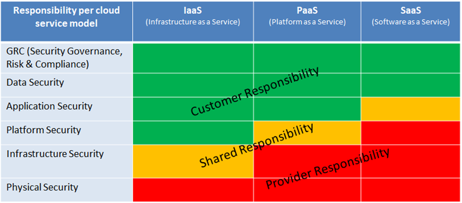
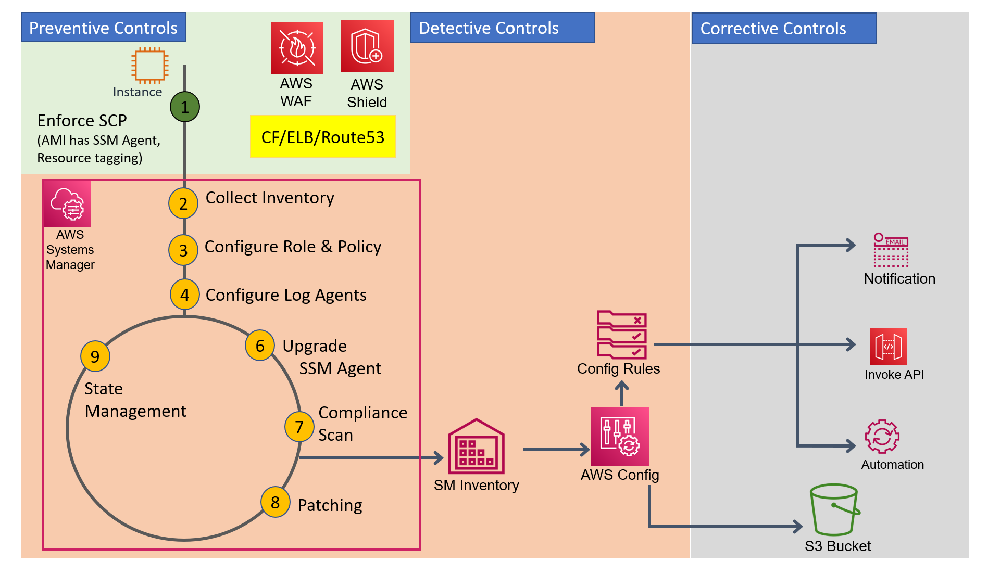

# Addressing Compliace in Public Cloud
Compliance is one of the primary concerns which inhibits many organizations from adopting cloud-first strategy. However, a clear understanding of how compliance can be achieved in public cloud can enable companies to capitalize on the business agility and growth that the public cloud provides.
Often compliance is discussed together with Security as the controls necessary to achieve compliance are often implemented under the auspices of security.

The success of compliance on-premises or in the cloud is dependent on some primary security factors like :-
* full control and visibility of the usage of AWS resources
* immutable logging
* monitoring real time and at scale 
* in-time implementation of patch management

To achieve the above factors, it is important to understand the **Public Cloud Responsibility Sharing Model**

As we can see in the above diagram, as we from left (IaaS) to right (SaaS) responsibilities shift from Customer to Provider.

# Basics of Security Compliance and AWS Services

## Prerequisites:-
Organization has AWS [**Landing Zone**](https://aws.amazon.com/solutions/implementations/aws-landing-zone/) with Accounts isolated based on "separation of concern" or "other preferences"
Organization has [**resource tagging**](https://docs.aws.amazon.com/general/latest/gr/aws_tagging.html) policy and all resources are tagged accordingly

